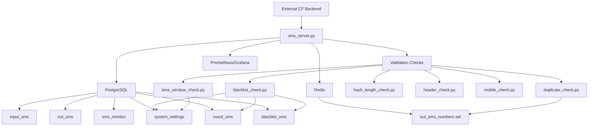

# SMS Gateway Python Files Functionality Summary

This document summarizes the functionality of all Python files in the SMS Gateway codebase, including startup conditions, process frequencies, database connections, and a Mermaid diagram illustrating the system architecture.

## Overview
The SMS Gateway system consists of a main server application (`sms_server.py`) and a set of validation check modules in the `checks/` directory. The system processes incoming SMS messages, validates them through configurable checks, and stores valid messages for further processing.

## File Summaries

### sms_server.py
**Functionality**: Main FastAPI application that serves as the SMS receiver service. It handles incoming SMS via POST endpoint, processes messages in batches, runs validation checks, and manages data flow between PostgreSQL and Redis.

**Key Features**:
- Receives SMS messages and stores them in `input_sms` table
- Processes messages in batches using a background task
- Runs configurable validation checks on each SMS
- Forwards valid SMS to `out_sms` table and Redis cache
- Provides health check endpoint
- Supports optional forwarding to external CF backend

**Startup Conditions**: On application startup, it warms up the Redis cache with existing sender numbers from `out_sms` table and starts the batch processor task.

**Process Frequency**: Batch processor runs continuously every 1 second, processing configurable batch sizes.

**Database Connections**:
- **PostgreSQL Tables**: `input_sms`, `out_sms`, `sms_monitor`, `system_settings`
- **Redis**: `out_sms_numbers` set for caching processed sender numbers

### checks/blacklist_check.py
**Functionality**: Validates SMS based on sender message frequency to prevent spam. Tracks message counts per sender and blacklists senders exceeding a threshold.

**Database Connections**:
- **PostgreSQL Tables**: `system_settings` (for threshold), `count_sms`, `blacklist_sms`

### checks/duplicate_check.py
**Functionality**: Checks if the sender number has already been processed (exists in the output set) to prevent duplicate processing.

**Database Connections**:
- **Redis**: `out_sms_numbers` set

### checks/hash_length_check.py
**Functionality**: Validates SMS message length and optionally computes/verifies HMAC hash for integrity. Falls back to basic length check if no secret key is provided.

**Database Connections**: None

### checks/header_check.py
**Functionality**: Placeholder for header validation logic. Currently checks the length of the first word in the message as an example.

**Database Connections**: None

### checks/mobile_check.py
**Functionality**: Validates that the SMS message contains a valid 10-digit mobile number using regex.

**Database Connections**: None

### checks/time_window_check.py
**Functionality**: Checks if the SMS was received within a configurable time window from the current time.

**Database Connections**:
- **PostgreSQL Tables**: `system_settings` (for time window setting)

## Startup Conditions
When the Ansible playbook (`setup_sms_gateway.yml`) executes:
1. Docker containers for PostgreSQL, Redis, PgBouncer, Prometheus, Grafana, and the SMS receiver are created and started
2. Database schema is initialized with tables and initial settings
3. SMS server container starts, triggering the FastAPI app startup event
4. Redis cache is warmed up with existing sender numbers
5. Batch processor background task begins running every 1 second
6. Health endpoints become available for monitoring

## Process Frequencies
- **Batch Processing**: Runs every 1 second in `sms_server.py`
- **Validation Checks**: Executed per SMS during batch processing
- **Cache Warmup**: Once on startup
- **Health Checks**: On-demand via HTTP endpoint

## System Architecture Diagram

## Database Schema Overview
- **input_sms**: Stores incoming SMS messages
- **out_sms**: Stores validated outgoing SMS messages
- **sms_monitor**: Tracks validation results and processing status
- **system_settings**: Stores configurable system parameters
- **count_sms**: Tracks message counts per sender for blacklist checks
- **blacklist_sms**: Stores blacklisted sender numbers

This architecture ensures efficient processing, validation, and monitoring of SMS messages with proper data persistence and caching.
