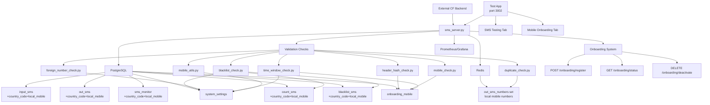

# SMS Gateway Python Files Functionality Summary

This document summarizes the functionality of all Python files in the SMS Gateway codebase, including startup conditions, process frequencies, database connections, and a Mermaid diagram illustrating the system architecture.

## Overview
The SMS Gateway system consists of a main server application (`sms_server.py`), a set of validation check modules in the `checks/` directory, and an onboarding system for mobile number validation. The system processes incoming SMS messages, validates them through configurable checks with country code support, and stores valid messages for further processing.

## File Summaries

### sms_server.py
**Functionality**: Main FastAPI application that serves as the SMS receiver service and onboarding system. It handles incoming SMS via POST endpoint (supporting both JSON and form-encoded data), processes messages in batches, runs validation checks, and manages data flow between PostgreSQL and Redis.

**Key Features**:
- Receives SMS messages in multiple formats (JSON/form-encoded) and stores them in `input_sms` table with structured mobile data (country code + local mobile)
- Processes messages in batches using a background task with consolidated validation pipeline
- Runs configurable validation checks on each SMS including country code validation
- Forwards valid SMS to `out_sms` table and Redis cache using local mobile numbers
- Provides onboarding endpoints for mobile number registration and hash generation
- Provides health check endpoint and onboarding status tracking
- Supports optional forwarding to external CF backend
- Comprehensive logging with rotating file handlers

**Startup Conditions**: On application startup, it warms up the Redis cache with existing local mobile numbers from `out_sms` table and starts the batch processor task.

**Process Frequency**: Batch processor runs continuously every 1 second, processing configurable batch sizes.

**Database Connections**:
- **PostgreSQL Tables**: `input_sms`, `out_sms`, `sms_monitor`, `system_settings`, `onboarding_mobile`, `blacklist_sms`, `count_sms`
- **Redis**: `out_sms_numbers` set for caching processed local mobile numbers

**Onboarding Endpoints**:
- `POST /onboarding/register` - Register mobile number and generate hash
- `GET /onboarding/status/{mobile_number}` - Check onboarding status
- `DELETE /onboarding/{mobile_number}` - Deactivate mobile number

### checks/mobile_utils.py
**Functionality**: Utility functions for mobile number normalization and country code handling. Provides consistent mobile number processing across all validation checks.

**Key Features**:
- Normalizes mobile numbers to extract country code and local number
- Supports multiple country codes from system settings
- Handles various input formats (+919699511296, 919699511296, 9699511296)

**Database Connections**:
- **PostgreSQL Tables**: `system_settings` (for allowed country codes)

### checks/blacklist_check.py
**Functionality**: Validates SMS based on sender message frequency to prevent spam. Tracks message counts per local mobile number and blacklists senders exceeding a threshold. Uses structured mobile data for consistent tracking.

**Database Connections**:
- **PostgreSQL Tables**: `system_settings` (for threshold), `count_sms`, `blacklist_sms`

### checks/duplicate_check.py
**Functionality**: Checks if the local mobile number has already been processed (exists in the Redis set) to prevent duplicate processing. Uses structured mobile data for consistency.

**Database Connections**:
- **Redis**: `out_sms_numbers` set (stores local mobile numbers)

### checks/foreign_number_check.py
**Functionality**: Validates if the sender's mobile number is from an allowed country based on country code. Supports configurable allowed country codes and can be enabled/disabled via settings.

**Database Connections**:
- **PostgreSQL Tables**: `system_settings` (for allowed country codes and validation toggle)

### checks/header_hash_check.py
**Functionality**: Consolidated validation for SMS header format (ONBOARD:) and hash verification. Validates message format, extracts hash, checks against stored hash in onboarding_mobile table for the local mobile number.

**Key Features**:
- Validates ONBOARD:<hash> format
- Checks 64-character hex hash format
- Compares against stored hash in onboarding_mobile table
- Uses local mobile number for lookup consistency

**Database Connections**:
- **PostgreSQL Tables**: `onboarding_mobile` (for hash verification)

### checks/mobile_check.py
**Functionality**: Validates that the sender's local mobile number exists in the onboarding_mobile table and is active. Uses structured mobile data for consistent validation.

**Database Connections**:
- **PostgreSQL Tables**: `onboarding_mobile` (for mobile number verification)

### checks/time_window_check.py
**Functionality**: Validates time window between onboarding mobile request timestamp and SMS received timestamp. Uses local mobile number to find the onboarding record and configurable time window from settings.

**Database Connections**:
- **PostgreSQL Tables**: `system_settings` (for time window setting), `onboarding_mobile` (for request timestamp)

## Startup Conditions
When the Ansible K3s playbook (`setup_sms_bridge_k3s.yml`) executes:
1. K3s containers for PostgreSQL, Redis, PgBouncer, Prometheus, Grafana, and the SMS receiver are created and started
2. Database schema is initialized with tables including onboarding_mobile and structured mobile data columns
3. SMS server container starts, triggering the FastAPI app startup event
4. Redis cache is warmed up with existing local mobile numbers from out_sms table
5. Batch processor background task begins running every 1 second
6. Health endpoints and onboarding endpoints become available for monitoring
7. Test application becomes available on port 3002 with tabbed interface for SMS testing and mobile onboarding

## Process Frequencies
- **Batch Processing**: Runs every 1 second in `sms_server.py`
- **Validation Checks**: Executed per SMS during batch processing
- **Cache Warmup**: Once on startup
- **Health Checks**: On-demand via HTTP endpoint

## System Architecture Diagram

## Database Schema Overview
- **input_sms**: Stores incoming SMS messages with structured mobile data (sender_number, country_code, local_mobile)
- **out_sms**: Stores validated outgoing SMS messages with structured mobile data
- **sms_monitor**: Tracks validation results and processing status with structured mobile data
- **system_settings**: Stores configurable system parameters including country codes and validation settings
- **count_sms**: Tracks message counts per local mobile number for blacklist checks with country code
- **blacklist_sms**: Stores blacklisted local mobile numbers with country code
- **onboarding_mobile**: Stores mobile number registration data with hash and salt for validation

## Key Features
- **Country Code Support**: Structured storage and validation of mobile numbers with country codes
- **Form Data Compatibility**: Accepts both JSON and form-encoded SMS data from mobile applications
- **Consolidated Validation**: Streamlined validation pipeline with header_hash_check combining multiple validations
- **Onboarding System**: Complete mobile number registration and validation workflow
- **Multi-format Support**: Handles various mobile number formats (+919699511296, 919699511296, 9699511296)
- **Consistent Mobile Handling**: Uses local mobile numbers (without country codes) for internal validation consistency

This architecture ensures efficient processing, validation, and monitoring of SMS messages with proper data persistence, caching, and comprehensive mobile number onboarding capabilities.
